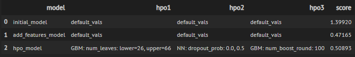
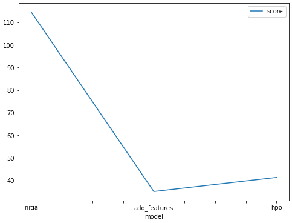
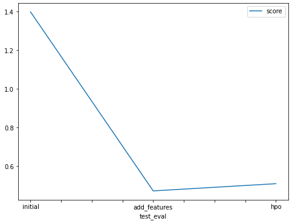

# Report: Predict Bike Sharing Demand with AutoGluon Solution
Yasmine HABCHI

## Initial Training  
### What did you realize when you tried to submit your predictions? What changes were needed to the output of the predictor to submit your results?  
The initial model, trained on raw data without any data analysis or feature engineering, did not perform well and generated many errors. Additionally, some predictions included negative values. Since Kaggle does not accept negative values in submissions, I replaced all negative predictions with `0` to ensure the submission was valid.

### What was the top-ranked model that performed?  
The top-performing model was `WeightedEnsemble_L3`, which utilized the dataset with added features and provided the best results.

---

## Exploratory Data Analysis and Feature Creation  
### What did the exploratory analysis find, and how did you add additional features?  
During analysis, I split the `datetime` feature into `month`, `day`, `year`, and `hour` components. This breakdown was essential to help the model capture seasonal trends. I also converted `season` and `weather` from integer data types to categorical variables, which allowed the model to interpret them more effectively.

### How much better did your model perform after adding additional features, and why do you think that is?  
Adding these features improved performance because they provided better predictors for the target variable. Separating the `datetime` feature into its components helped the model detect seasonality patterns, which are crucial in predicting bike demand. Transforming certain variables into categorical types further enhanced the model’s ability to make accurate predictions.

---

## Hyperparameter Tuning  
### How much better did your model perform after trying different hyperparameters?  
Hyperparameter tuning improved performance in some cases, but not significantly. Some configurations were beneficial, while others negatively impacted the model’s performance. This highlights the trial-and-error nature of hyperparameter tuning.

### If you were given more time with this dataset, where do you think you would spend more time?  
I would spend more time conducting a deeper exploratory data analysis to uncover additional insights and refine the feature set. I would also explore advanced hyperparameter tuning strategies to optimize model performance further.

---

### Table: Models, Hyperparameters, and Scores  

| Model         | Hyperparameter 1                | Hyperparameter 2          | Hyperparameter 3      | Kaggle Score |
|---------------|----------------------------------|----------------------------|-----------------------|--------------|
| initial       | default_vals                    | default_vals               | default_vals          | 1.39920      |
| add_features  | default_vals                    | default_vals               | default_vals          | 0.47165      |
| hpo           | num_leaves: 26–66               | dropout_prob: 0.0, 0.5     | num_boost_round: 100  | 0.50893      |

---

### Line Plot: Top Model Scores Across Training Runs  

---

### Line Plot: Kaggle Scores for Prediction Submissions  

---

## Summary  
In this project, I applied all the concepts covered in this course to develop a machine learning regression model using the AutoGluon framework. The project demonstrated the importance of feature engineering and hyperparameter tuning in improving model performance. By refining the dataset and carefully selecting features, I achieved a Kaggle score that was competitive with those achieved by experienced developers.
